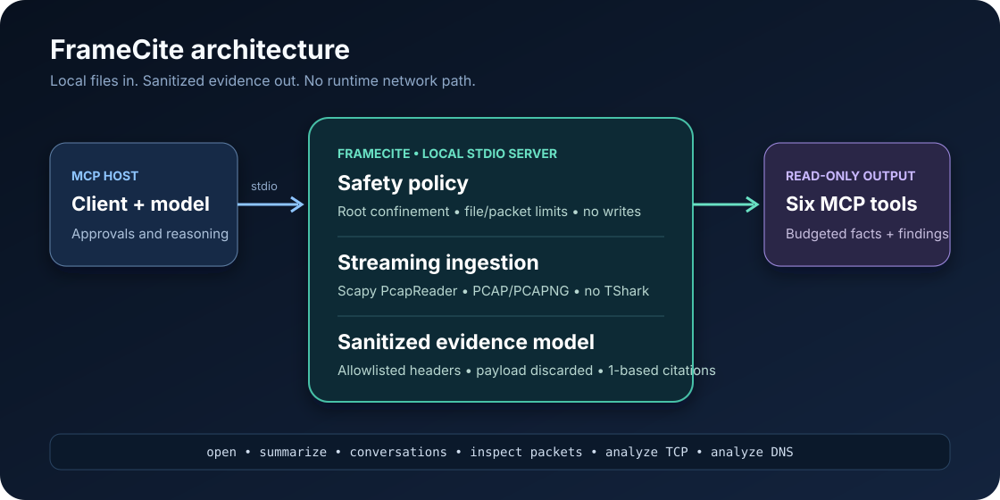

# FrameCite

[](https://github.com/daniissac/framecite/actions/workflows/ci.yml)
[](https://github.com/daniissac/framecite/actions/workflows/public-corpus.yml)
[](LICENSE)
[](https://modelcontextprotocol.io/)

**Local PCAP troubleshooting with packet-level citations.**

FrameCite is a deliberately small Model Context Protocol server that turns packet captures into bounded facts and deterministic troubleshooting findings. It uses Scapy directly—no Wireshark, TShark, cloud service, embedded chat UI, or model API key.

<!-- mcp-name: io.github.daniissac/framecite -->

> [!IMPORTANT]
> Packet captures can contain credentials, private addresses, personal data, and proprietary traffic. FrameCite processes only local files beneath directories you explicitly allow. Raw payload bytes are discarded during ingestion and can never be returned by its MCP tools.

## Why FrameCite

- **No Wireshark/TShark dependency:** streaming PCAP and PCAPNG parsing uses Scapy.
- **Local-only by default:** the server exposes only MCP `stdio`; it has no HTTP transport or runtime network client.
- **Payload redaction is mandatory:** tools return allowlisted headers plus payload length, never payload content.
- **Token-budgeted output:** every tool applies a conservative UTF-8 JSON budget and paginates only at whole-item boundaries.
- **Packet-level evidence:** every generated conclusion contains one or more 1-based packet citations.
- **Small, safe surface:** six read-only troubleshooting tools; no capture, injection, shell, arbitrary filter, write, or raw-byte tools.
- **Two-layer verification:** hermetic synthetic tests cover failures and privacy boundaries; a hash-pinned public corpus checks real PCAP/PCAPNG compatibility without redistributing captures.



## Start in one command

Until the first PyPI release, run directly from GitHub with [`uvx`](https://docs.astral.sh/uv/guides/tools/):

```bash
uvx --from git+https://github.com/daniissac/framecite framecite --root /absolute/path/to/captures
```

The `--root` option is required. Repeat it to allow another capture directory. FrameCite resolves symlinks before enforcing those boundaries.

An MCP client configuration uses the same command:

```json
{
  "mcpServers": {
    "framecite": {
      "command": "uvx",
      "args": [
        "--from",
        "git+https://github.com/daniissac/framecite",
        "framecite",
        "--root",
        "/absolute/path/to/captures"
      ]
    }
  }
}
```

After the PyPI release, the command becomes `uvx framecite --root /absolute/path/to/captures`.

## MCP surface

| Tool | Purpose |
|---|---|
| `open_capture` | Stream one allowed PCAP/PCAPNG into a bounded, payload-free in-memory model. |
| `summarize_capture` | Return capture facts and prioritized deterministic findings. |
| `list_conversations` | List TCP/UDP conversations with first, last, and sampled packet evidence. |
| `inspect_packets` | Inspect up to 50 explicit 1-based packets using allowlisted headers. |
| `analyze_tcp` | Check resets, zero windows, SYN repeats, missing SYN-ACKs, and repeated sequence ranges. |
| `analyze_dns` | Check response codes, matching responses, and repeated identical queries; supplied names are returned only as session-local tokens. |

FrameCite also provides sanitized manifest and packet resources under `framecite://` plus a `triage_capture` prompt that requires the host model to distinguish fact from inference and cite `[packet N]`.

### Evidence shape

```json
{
  "rule_id": "tcp-reset",
  "level": "warning",
  "conclusion": "1 TCP reset packet(s) were observed.",
  "evidence": [
    {
      "packet_number": 7,
      "time_offset_us": 60000,
      "observation": "TCP RST flag is set."
    }
  ],
  "limitations": [],
  "method": "deterministic"
}
```

Findings are capture-bounded observations, not proof of root cause. FrameCite explicitly reports boundary limitations where missing traffic or asymmetric capture could change an interpretation.

## Safety limits

The person starting the server controls limits; the model cannot increase them:

```text
--root PATH          required; repeatable allowed directory
--max-file-mb 100    maximum capture size
--max-packets 50000  maximum packets retained per capture
--max-captures 4     maximum sanitized captures in memory
```

Additional guarantees:

- Only regular `.pcap` and `.pcapng` files are accepted.
- PCAP record boundaries and PCAPNG block lengths are validated before decoded results are accepted.
- Paths are confined after strict resolution, blocking traversal and symlink escape.
- Files are re-checked after parsing and rejected if they changed.
- Raw Scapy packets and payload bytes are never retained in the capture cache.
- DNS question names are replaced with non-reversible, session-local HMAC tokens plus length and label count.
- Captured length and original wire length are reported separately; timestamp regressions are disclosed.
- Tool budgets accept 256–2,000 tokens; smaller requests fail explicitly and larger requests are capped.
- DNS names and decoded metadata are treated as untrusted, stripped of controls, and length-limited.
- Tool annotations declare read-only, non-destructive, closed-world behavior; repeatable analysis calls are also marked idempotent. The code enforces the restrictions independently.
- Logs use standard error so they cannot corrupt MCP `stdio` messages.

See [SECURITY.md](SECURITY.md) for the threat model and reporting process.

## Known limits

- Scapy is not a replacement for Wireshark's full dissector collection or TCP reassembly engine.
- Unsupported link types or dissectors safely degrade to redacted `OTHER` records; protocol auto-decoding depends on Scapy support.
- DNS auto-decoding is limited to traffic Scapy identifies as DNS; multicast DNS is counted but excluded from unicast transaction pairing.
- Encrypted payloads such as TLS and DoH remain opaque.
- A capture may begin or end mid-conversation, omit one direction, or contain duplicate packets.
- Token counts are conservative estimates because the server does not know the host model's tokenizer.
- FrameCite analyzes existing files only; it intentionally does not perform live capture.

## Development

```bash
python -m venv .venv
source .venv/bin/activate
python -m pip install -e ".[dev]"
ruff check .
ruff format --check .
pytest
python -m build
```

Normal tests run with internet sockets disabled. Synthetic fixtures include payload secrets, private DNS names, malformed/truncated files, clock regressions, and prompt-injection text so MCP outputs can be checked without publishing a real capture.

### Public compatibility corpus

Run the opt-in upstream compatibility check after installing the project:

```bash
python scripts/verify_public_corpus.py
```

The manifest pins 11 small captures from immutable Wireshark, tcpdump, libpcap, and Tcpreplay revisions. The runner verifies HTTPS sources, exact sizes, SHA-256 hashes, 236 packet outcomes, both PCAPNG byte orders, redaction, evidence references, token budgets, pagination, all six MCP tools, and a real `stdio` process. Files are downloaded into a temporary directory and deleted; they are never committed or uploaded as artifacts.

This networked check is separate from pull-request CI and runs weekly or on demand through [Public PCAP compatibility](.github/workflows/public-corpus.yml). Source and license links live beside every entry in [the metadata-only manifest](tests/public_corpus/manifest.json).

## Contributing

Focused issues and pull requests are welcome. Do not attach real or sensitive packet captures to public issues; add a minimal synthetic fixture instead. See [CONTRIBUTING.md](CONTRIBUTING.md).

## License

[MIT](LICENSE)
