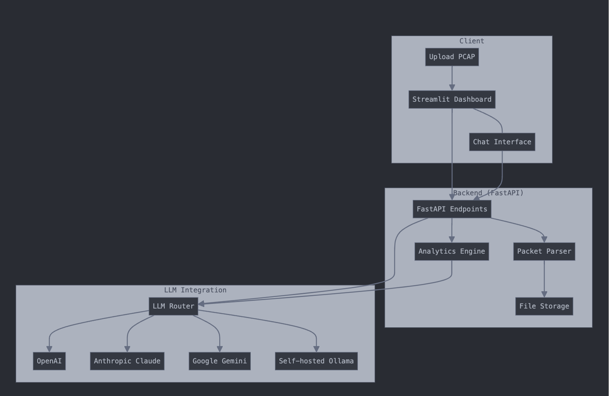

## PacketPilot

PacketPilot is comprehensive packet analysis tool that integrates with multiple LLM providers and offers a web-based interface for analyzing network traffic. 

### Architecture Overview



- A **FastAPI backend** for processing PCAP files and exposing APIs
- A **Streamlit frontend** dashboard with interactive visualizations and chat interface
- **LLM integration** with multiple providers (OpenAI, Anthropic Claude, Google Gemini, and Ollama)
- **Docker containerization** for easy deployment

### Key Features

1. **PCAP Processing**
   - Upload and analyze PCAP files using Scapy and PyShark
   - Extract detailed packet information and generate summaries

2. **Visual Analytics Dashboard**
   - Protocol distribution charts
   - Top talkers visualization
   - Connection analysis
   - Interactive packet explorer with detailed view

3. **LLM-Powered Analysis**
   - Chat interface for asking natural language questions about the capture
   - Support for multiple LLM providers with fallback options
   - Contextual prompting to get relevant insights

4. **Deployment**
   - Docker Compose configuration for containerized deployment
   - Environment variable configuration for API keys
   - Volume mounting for persistent storage

### Usage Instructions

1. **Setup**
   ```bash
   # Clone and navigate to the directory
   cd packetpilot
   
   # Configure API keys
   cp .env.template .env
   # Edit .env with your API keys
   
   # Start the containers
   docker-compose up -d
   ```

2. **Access the Dashboard**
   - Open your browser and navigate to http://localhost:8501
   - Upload a PCAP file using the sidebar
   - Explore the visualizations and packet details
   - Ask questions using the Chat Analysis tab

The tool provides a user-friendly interface for network analysts to work with packet captures and get AI-assisted insights, making it easier to understand complex network traffic patterns.
